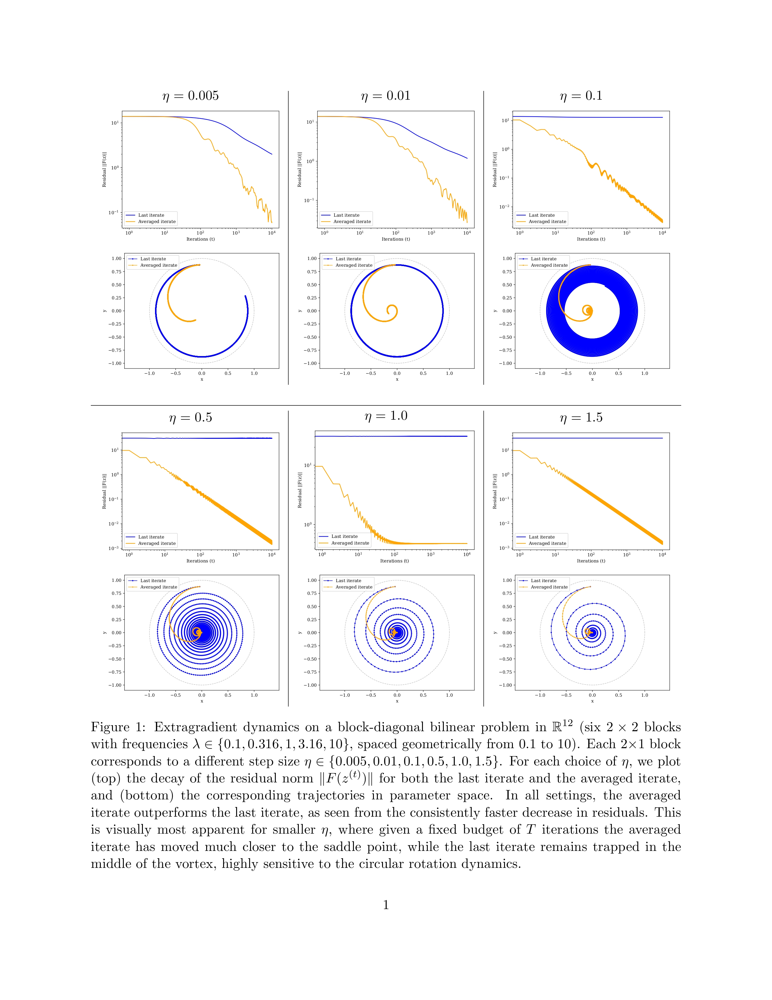

# Empirical Experiments: Last Iterate vs Averaged Iterate in Convex-Concave Saddle Point Problems


This project demonstrates average vs last iterate experiments in optimization, including a 2D bilinear example and a 12D example.

## Example Results

Below are example results from the experiments:

### 2D Bilinear Example


### 12D Example


## Setup

1. Create a virtual environment and install dependencies:
   ```powershell
   python -m venv venv
   venv\Scripts\activate
   pip install -r requirements.txt
   ```

## Running Experiments

To run the experiments, simply execute:

```powershell
python main.py
```


All results will be saved in the `./results` directory.

## Acknowledgements

This project is based on the paper:

```
@misc{golowich2020iteratesloweraveragediterate,
   title={Last Iterate is Slower than Averaged Iterate in Smooth Convex-Concave Saddle Point Problems}, 
   author={Noah Golowich and Sarath Pattathil and Constantinos Daskalakis and Asuman Ozdaglar},
   year={2020},
   eprint={2002.00057},
   archivePrefix={arXiv},
   primaryClass={cs.LG},
   url={https://arxiv.org/abs/2002.00057}, 
}
```

This project was done as part of the course "Advanced Topics in the Connection Between Computational Learning and Game
Theories" (Course No. 03684251) at Tel Aviv University.
